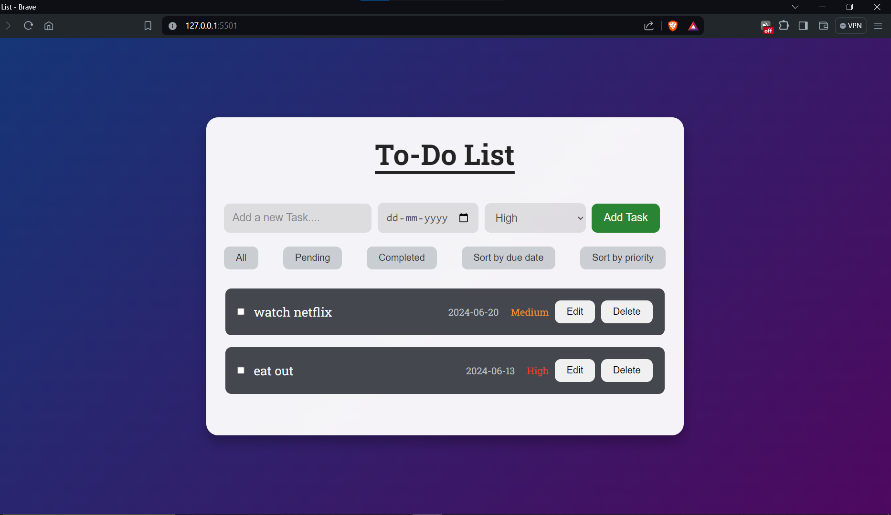
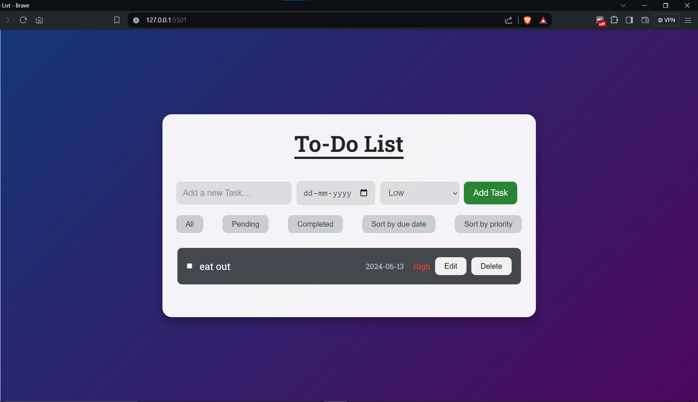

# To-Do List Web Application

## WEB DEVELOPMENT INTERNSHIP (TASK 2)

### Project Title
To-Do List Web Application

### Project Description
The objective of this project is to create a web-based to-do list application that allows users to manage their tasks and stay organized. This project will involve building a user interface to add, edit, and mark tasks as completed. It's a great way for beginners to learn about web development using HTML, CSS, JavaScript, and potentially a backend technology like Node.js.

### Features

#### 1. Task Management
Enable users to add, edit, and delete tasks on the to-do list.



#### 2. Task Status
Allow users to mark tasks as completed or pending.


#### 3. User Interface
Design a user-friendly interface with sections for adding tasks, displaying the task list, and managing tasks.


#### 4. Storage
Store tasks in the browser's local storage to persist data across sessions.



#### 5. Priority Levels
Implement priority levels (e.g., high, medium, low) for tasks to help users organize their to-do list.


#### 6. Filtering and Sorting
Provide options to filter tasks by status (completed/pending) and sort tasks by priority or due date.


#### 7. Responsive Design
Ensure the application is responsive and works well on various screen sizes.


### Getting Started

1. **Clone the repository:**
   ```bash
   git clone https://github.com/your-username/todo-list-web-app.git

2. **Clone the repository:**
   ```bash
   cd todo-list-web-app

3. **Clone the repository:**
   ```bash
   open index.html with live-server extension

### Technologies Used

- **HTML**: For creating the structure of the web pages.
- **CSS**: For styling the application.
- **JavaScript**: For adding interactivity and handling task management.
- **Local Storage**: For persisting tasks data across sessions.
- **Node.js (Optional)**: For backend support if required.

### Contribution
Feel free to fork this repository and contribute by submitting a pull request. For major changes, please open an issue first to discuss what you would like to change.

### License
This project is licensed under the MIT License.

### Contact
For any queries feel free to contact pal97117@gmail.com

